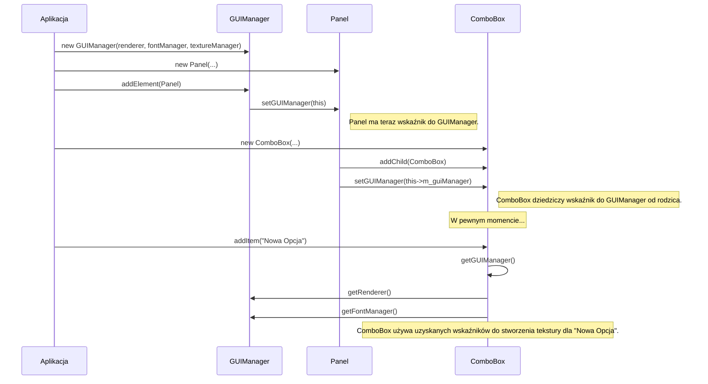

# Plan Refaktoryzacji: Dostęp do Kontekstu Renderowania

## 1. Problem do rozwiązania

Komponenty takie jak `ComboBox` czy `TextInput` potrzebują dostępu do `SDL_Renderer` oraz menedżerów zasobów (`FontManager`, `TextureManager`) w trakcie swojego cyklu życia, ale po utworzeniu instancji. Jest to konieczne do dynamicznego tworzenia tekstur (np. z tekstu) w odpowiedzi na akcje użytkownika (np. dodanie nowej opcji do `ComboBox`) lub zmiany stanu.

Wpychanie tych zależności do konstruktorów jest błędem projektowym, ponieważ:
-   Komplikuje testy jednostkowe, wymuszając tworzenie fałszywego kontekstu renderowania.
-   Wiąże logikę komponentu z infrastrukturą aplikacji zbyt wcześnie.
-   Zmniejsza elastyczność, uniemożliwiając tworzenie komponentów w oderwaniu od głównej pętli aplikacji.

## 2. Proponowane rozwiązanie: Dostęp do Kontekstu przez `GUIManager`

Zamiast "wpychać" zależności do komponentów, umożliwimy im "sięganie" po nie w górę drzewa hierarchii, do `GUIManager`, który będzie pełnił rolę centralnego dostawcy kontekstu.

### 2.1. Kluczowe zmiany w architekturze

1.  **`GUIManager` jako dostawca kontekstu:**
    *   `GUIManager` będzie przechowywał wskaźniki do `SDL_Renderer`, `FontManager` i `TextureManager`, otrzymując je w swoim konstruktorze.
    *   Udostępni publiczne metody `getRenderer()`, `getFontManager()` i `getTextureManager()`.

2.  **Wskaźnik na `GUIManager` w `GUIElement`:**
    *   Do klasy bazowej `GUIElement` zostanie dodany chroniony wskaźnik: `GUIManager* m_guiManager = nullptr;`.
    *   Zostanie również dodana publiczna metoda `void setGUIManager(GUIManager* manager);` oraz `GUIManager* getGUIManager() const;`.

3.  **Propagacja wskaźnika `m_guiManager`:**
    *   **Na najwyższym poziomie:** Gdy element jest dodawany bezpośrednio do `GUIManager` za pomocą `GUIManager::addElement(element)`, menedżer ustawi wskaźnik na siebie w tym elemencie: `element->setGUIManager(this);`.
    *   **W dół drzewa:** Gdy element-rodzic dodaje do siebie dziecko za pomocą `GUIElement::addChild(child)`, przekaże mu swój własny wskaźnik na menedżera: `child->setGUIManager(this->m_guiManager);`.

### 2.2. Diagram sekwencji

Poniższy diagram ilustruje, jak wskaźnik do `GUIManager` jest propagowany w dół drzewa, a następnie wykorzystywany przez komponent do pobrania renderera.

### 3. Korzyści z tego podejścia

*   **Minimalna inwazyjność:** Konstruktory komponentów i sygnatura metody `render` pozostają niezmienione, co minimalizuje konieczny refaktoring.
*   **Czysta separacja:** Komponenty nie przechowują bezpośrednio wskaźnika do renderera. Przechowują wskaźnik do swojego menedżera, co jest logicznie poprawne. Dostęp do kontekstu jest jawny i kontrolowany.
*   **Zachowanie elastyczności:** Komponenty nadal mogą być tworzone i istnieć w oderwaniu od `GUIManager`. Pełną funkcjonalność (zdolność do tworzenia zasobów) uzyskują dopiero po włączeniu do zarządzanego drzewa GUI.
*   **Rozwiązanie problemu:** Każdy komponent, w dowolnym momencie po dodaniu do drzewa, może uzyskać dostęp do renderera i menedżerów, aby wykonać operacje zależne od kontekstu graficznego.

## 4. Wpływ na istniejący kod

-   **`gui.hpp` / `gui.cpp`:** Należy dodać pole `m_guiManager` i metody `setGUIManager`/`getGUIManager` do `GUIElement` oraz zaktualizować `addChild`.
-   **`gui_manager.hpp` / `gui_manager.cpp`:** Należy zaktualizować konstruktor, dodać pola na kontekst, metody `get...` oraz zaktualizować `addElement`.
-   **`combobox.cpp` (i inne komponenty):** W miejscach, gdzie potrzebny jest renderer/manager, należy go pobrać z `m_guiManager`.
-   **Testy i przykłady:** Pozostaną w większości niezmienione, ponieważ konstruktory komponentów się nie zmieniają. Zmiany będą potrzebne w inicjalizacji `GUIManager`.